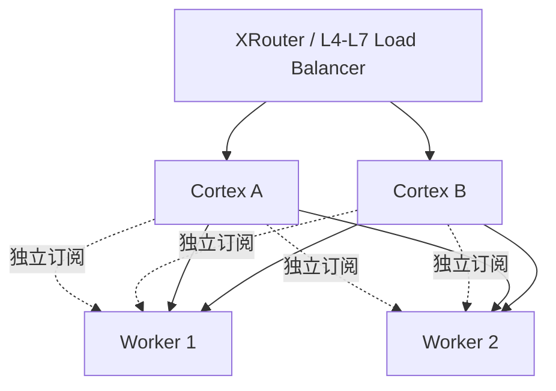

# 高可用部署

## 1. 可用性模型

Cortex 实例维护本地内存账本，初始版本不在实例之间复制 Radix HashTree，也不引入 Leader 选举或分布式共识。每个实例独立订阅同一组 Worker 事件、执行同步门禁，并独立形成路由视图。

该模型优先保证安全降级和故障隔离：副本视图短暂不一致可能造成命中率下降或负载选择不同，但任何副本都不得基于 `STALE` 账本宣称精确命中。

## 2. 推荐拓扑



生产环境至少部署两个 Cortex 副本，分散到不同故障域。上游只向 `/health/ready` 成功的副本发送新请求。SSE 长连接应启用连接排空：实例退出就绪后停止接收新请求，并为已有流保留足够的优雅终止时间。

## 3. 启动、滚动升级与故障转移

新实例启动后按以下顺序接流：

1. 加载并校验静态配置、Tokenizer 与哈希配置。
2. 建立 Worker 健康检查和事件订阅。
3. 至少存在一个健康 Worker，可安全执行负载降级路由。
4. `/health/ready` 成功；此时不要求账本已经全部 `READY`。
5. 各 Worker 完成账本同步后，逐个开启精确 KV 路由。

滚动升级必须保持至少一个旧副本就绪。新副本没有完成账本同步前会降低 Cache 命中率，这是可接受的预期行为；不得通过复制未知版本的内存快照来缩短启动时间。

实例崩溃时，上游把新请求转移到其他就绪副本。已开始向客户端发送 SSE 的请求不能透明迁移，应由客户端或 XRouter 按请求幂等性决定是否重试。

## 4. 多副本流量策略

默认使用普通的最少连接或 P2C 在 Cortex 副本间分流。若实测发现不同副本独立调度显著降低 Cache 命中率，可由 XRouter 基于稳定的 Prompt 指纹做软亲和，但不得把它作为可用性前提。

软亲和必须满足：

- 副本不健康时立即失效并重新选择；
- 不依赖本地会话状态；
- 不把租户标识或原始 Prompt 暴露到不受信任的负载均衡层；
- 只影响 Cortex 副本选择，不替代 Cortex 对 Worker 真账的判断。

## 5. 容量与背压

每个 Cortex 副本必须能在另一个副本故障后承接预期流量，或由上游实施明确限流。需要分别设置：

```text
最大并发请求数
最大排队请求数与排队超时
每 Worker 最大连接数
ZMQ 事件缓冲上限
Radix HashTree 内存硬上限
Tokenizer 缓存内存硬上限
SSE 最大连接时长与排空时限
```

达到硬上限时应拒绝或降级新请求，不能无限排队或让账本更新饿死。事件摄取任务的调度与资源预算必须独立于请求代理任务。

## 6. 健康端点

`GET /health/live`：进程、异步运行时和关键后台任务没有不可恢复故障即返回成功。

`GET /health/ready`：配置有效、至少一个推理 Worker 可用且网关能安全选择降级路径时返回成功。响应体应汇总 `ready_workers`、`syncing_workers`、`stale_workers` 和当前能力 `exact_kv | degraded_only`。

管理和指标端点只能暴露在受控网络，不能通过公共推理入口直接访问。

## 7. 故障场景

| 故障 | 预期行为 |
| --- | --- |
| 单个 Cortex 崩溃 | 上游将新请求转移到其他副本；进行中的流由连接错误结束 |
| Cortex 与部分 Worker 网络分区 | 相关 Worker 变为 `STALE` / `OFFLINE`，其账本引用被撤销 |
| 所有账本未就绪 | 继续对健康 Worker执行负载降级路由，并明确标记模式 |
| 所有 Worker 不健康 | `/health/ready` 失败，新请求快速返回服务不可用 |
| 事件面拥塞 | 优先保护事件连续性；缓冲溢出则标记 `STALE` 并重同步 |
| 内存逼近硬上限 | 停止扩大账本或隔离受影响账本，保留基础代理能力 |
| XRouter 不可用 | 已进入 Cortex 的请求继续处理；Cortex 不接管租户鉴权或计费 |

## 8. 后续演进条件

只有在压测证明“独立账本导致的命中率损失”超过跨副本同步的复杂度和故障风险时，才评估共享事件日志或分区所有权。不得直接把 Redis、etcd 或数据库加入请求热路径；任何演进都必须保留本地只读快照和账本失效门禁。
