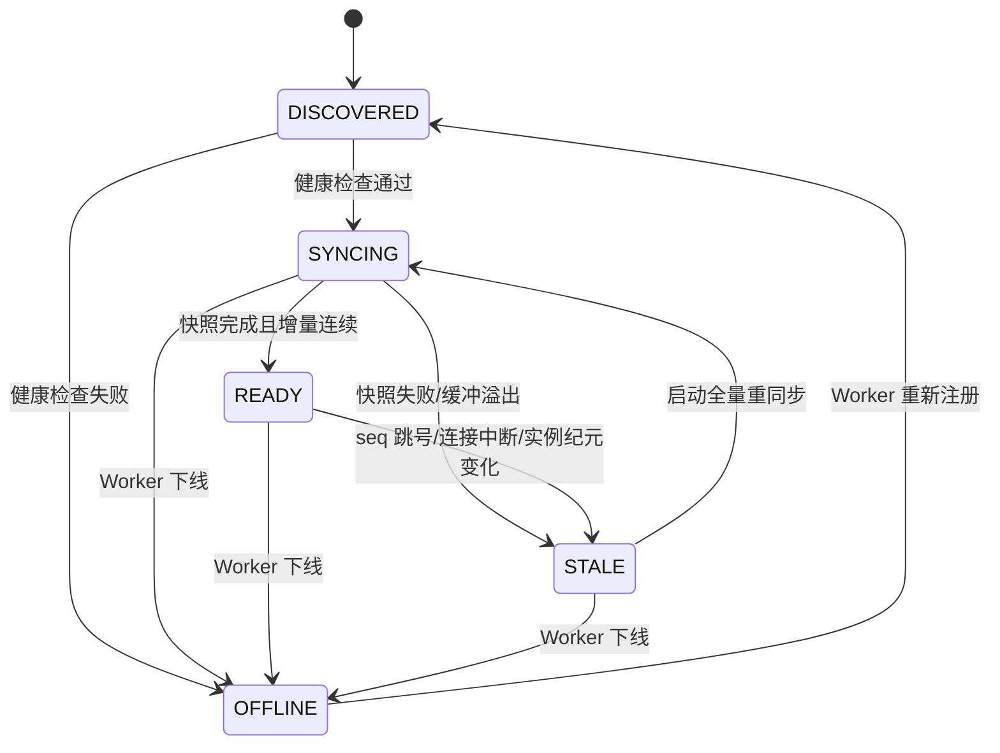

# 账本同步与一致性

## 1. 目标与一致性边界

Cortex 的 Radix HashTree 是路由索引，不是 KV Tensor 的权威存储。Worker 才是显存 KV 状态的最终事实来源。Cortex 只在能够证明某个 Worker 的快照与后续增量事件连续时，将其账本标记为 `READY` 并用于精确 KV 亲和路由。

系统保证“不会基于已知失效的账本宣称精确命中”，不保证 Cortex 多副本在同一时刻拥有完全相同的视图。事件延迟或副本重启可能降低命中率，但不得导致请求被发送到不健康 Worker。

## 2. Worker 账本状态机



| 状态 | 可参与精确 KV 路由 | 可参与降级路由 | 行为 |
| --- | --- | --- | --- |
| `DISCOVERED` | 否 | 否 | 校验注册信息并建立健康检查与事件连接 |
| `SYNCING` | 否 | 可配置 | 获取快照并缓冲快照基线之后的增量事件 |
| `READY` | 是 | 是 | 正常应用连续增量事件 |
| `STALE` | 否 | 仅健康时可配置 | 原子撤销账本引用并重新同步 |
| `OFFLINE` | 否 | 否 | 从 Live Pool 摘除并清理关联状态 |

## 3. 注册与实例身份

Worker 注册记录至少包含：

```text
worker_id           集群内稳定逻辑标识
instance_epoch      每次进程启动生成的新纪元
engine              sglang | vllm
model_id            模型部署标识
inference_endpoint  推理服务地址
event_endpoint      ZMQ 事件地址
snapshot_endpoint   全量 KV 元数据快照地址
config_fingerprint  Tokenizer 与哈希配置指纹
role                unified | prefill | decode
```

`worker_id + instance_epoch` 唯一标识一次 Worker 生命周期。收到旧纪元的迟到事件必须丢弃；同一 `worker_id` 出现新纪元时，必须先原子撤销旧账本，再进入 `SYNCING`。

## 4. 冷启动同步协议

单纯订阅 ZMQ `SUB` 无法获得订阅前的历史事件，因此 Cortex 不得把“重新订阅”视为完成同步。Worker 必须提供全量元数据快照，或提供语义等价的可重放事件源。

推荐同步顺序：

1. 建立事件订阅，记录当前 `instance_epoch`，开始缓冲增量事件。
2. 请求全量快照；快照响应包含 `instance_epoch`、`snapshot_seq`、分页信息和当前 Block 元数据。
3. 在隔离的新账本中构建快照，校验分页完整性、配置指纹和内容校验和。
4. 按序应用缓冲区内所有 `seq > snapshot_seq` 的事件；必须连续，不允许跳号。
5. 通过单次原子发布替换该 Worker 的只读账本视图，将状态切换为 `READY`。
6. 丢弃 `seq <= snapshot_seq` 的重复事件，继续消费后续增量。

若 Worker 暂不支持快照接口，Cortex 只能从空账本开始观察新事件，并将该 Worker 标记为 `PARTIAL` 能力。`PARTIAL` 不得对外宣称完整精确命中；MVP 可直接将其视为 `STALE` 并只做负载路由。

## 5. 增量事件规则

每条事件必须包含 `worker_id`、`instance_epoch`、`seq`、`event_type` 和引擎协议版本。

| 条件 | 处理 |
| --- | --- |
| `seq == last_seq + 1` | 应用事件并推进 `last_seq` |
| `seq <= last_seq` | 作为重复或迟到事件幂等丢弃 |
| `seq > last_seq + 1` | 标记 `STALE`，撤销精确路由资格并触发全量重同步 |
| `instance_epoch` 不一致 | 丢弃事件；若为新纪元则重建 Worker 生命周期 |
| 未知事件类型或协议版本 | 不尝试猜测，标记 `STALE` 并告警 |
| `AllBlocksCleared` | 原子清空该 Worker 的全部 Block 引用并推进序号 |

不允许在发生 Seq Gap 后继续“尽力应用”后续事件，否则账本会形成无法检测的假阳性。

## 6. 原子发布与内存管理

事件写入在后台构建新视图，请求热路径只读取已发布的不可变快照。Worker 从 `READY` 变为 `STALE` 或 `OFFLINE` 时，必须先发布不含该 Worker 引用的新视图，再释放旧节点。

Radix HashTree 必须配置实例级硬内存上限。接近上限时优先压缩无 Worker 引用节点和过期索引；如果仍无法满足预算，应将受影响 Worker 标记为 `STALE` 或关闭精确路由，不得随机丢弃仍对外声明有效的 Block。

## 7. 就绪与降级

`/health/live` 只判断 Cortex 进程及事件循环是否存活。`/health/ready` 判断请求是否至少可以安全走负载降级路径，不要求所有 Worker 账本均为 `READY`。

响应必须通过 `x-cortex-match-mode` 区分 `exact_kv_events`、`load_aware`、`fallback_p2c` 和 `fallback_round_robin`。只有 `READY` Worker 的连续账本命中才能使用 `exact_kv_events`。

## 8. 必需指标

```text
cortex_ledger_worker_state{worker_id,state}
cortex_ledger_last_seq{worker_id}
cortex_ledger_event_gap_total{worker_id}
cortex_ledger_resync_total{worker_id,reason}
cortex_ledger_sync_duration_seconds{worker_id}
cortex_ledger_buffered_events{worker_id}
cortex_ledger_nodes
cortex_ledger_memory_bytes
```

应对 `STALE` 持续时间、连续重同步失败、事件缓冲区逼近上限和账本内存逼近硬上限设置告警。
