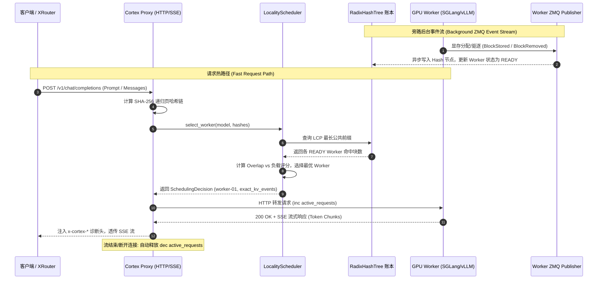

# Cortex 工程结构与模块说明 (Project Structure)

本文档详细说明 `cortex` 项目的代码组织结构、各子系统模块划分、数据流向以及核心组件的职责契约。

---

## 1. 顶层目录结构概览

```text
cortex/
├── Cargo.toml                    # Rust 2024 edition 项目依赖与编译配置
├── cortex.yaml                   # 网关运行时配置与 Worker 集群初始列表
├── AGENTS.md                     # 智能体协作契约与按需技能地图
├── README.md                     # 项目介绍与快速开始
├── docs/                         # 系统架构、工程规范与设计文档
│   ├── architecture-design.md    # 核心架构设计与演进路线
│   ├── design.md                 # Admin UI 设计规范与硬性纪律
│   ├── project-structure.md      # 工程结构与模块说明（本文档）
│   ├── ledger-sync.md            # 账本同步状态机规范
│   ├── tokenizer-hash-alignment.md # Tokenizer 与 Block Hash 对齐规范
│   ├── tokenizer-optimization-roadmap.md # 分词与模板渲染内部优化架构路线
│   ├── runtime-failure-semantics.md # 运行时与故障降级语义
│   ├── ha-deployment.md          # 高可用部署与容量模型
│   ├── sglang-live-integration-report.md # RTX 5090 集群联调与架构复盘报告
│   └── rtx-pro-6000-live-benchmark-report.md # RTX PRO 6000 硬件全链路实测报告
├── src/                          # Rust 后端高性能核心实现
│   ├── config/                   # 配置解析与模型配置
│   ├── hasher/                   # HashConfig 指纹与递归页哈希算法
│   ├── ledger/                   # RadixHashTree 内存账本与 Worker 状态机
│   ├── zmq/                      # ZMQ 异步事件摄取与序列号校验
│   ├── scheduler/                # 四级调度降级链与负载加权评分
│   ├── pd/                       # Prefill-Decode 两阶段编排与传输元数据
│   ├── proxy/                    # OpenAI 兼容 HTTP / SSE 流式转发管道
│   ├── metrics/                  # 健康探针 (/health/live, /health/ready) 与指标
│   ├── lib.rs                    # 模块导出定义
│   └── main.rs                   # 启动装配与 Axum 服务总入口
└── admin/                        # React 19 + TypeScript + Tailwind CSS 控制台
    ├── src/
    │   ├── index.css             # HSL 语义 Token 与设计系统基底
    │   ├── lib/
    │   │   ├── i18n/             # 中英双语对称国际化 (zh.ts, en.ts, index.ts)
    │   │   └── utils.ts          # Tailwind 类名合并工具 (clsx + twMerge)
    │   ├── components/layout/    # 控制台布局 (AppSidebar, SiteHeader, DashboardLayout)
    │   ├── pages/                # 页面组件 (ClusterOverview 概览与监控)
    │   ├── types/                # 前端 TypeScript 数据类型定义
    │   ├── App.tsx               # 路由总装配
    │   └── main.tsx              # React 渲染入口
    ├── package.json              # 前端依赖配置
    └── vite.config.ts            # Vite + Tailwind v4 + Vitest 测试配置
```

---

## 2. 后端核心模块详解 (`src/`)

Rust 后端采用 **Rust 2024 Edition**，基于 Tokio 异步运行时与 Axum/Tower Web 框架构建，严格保证请求热路径上的零拷贝与极低延迟。

### 2.1 `src/config/` (配置系统)
* **文件**：[`src/config/mod.rs`](file:///Users/xinference/github/cortex/src/config/mod.rs)
* **核心职责**：
  * 解析 `cortex.yaml` 配置文件及环境变量。
  * `WorkerConfig`：定义 Worker 唯一标识（ID）、模型标识（Model ID）、推理引擎类型（`sglang` / `vllm` / `dynamo`）、HTTP 端点、ZMQ 事件端点、Worker 角色（`standard` / `prefill` / `decode`）和分页大小（`page_size`）。
  * `SchedulerConfig`：定义 KV 亲和权重 $\alpha$、并发惩罚权重 $\beta$ 以及单机并发高水位阈值。

### 2.2 `src/hasher/` (分词与哈希引擎)
* **文件**：
  * [`src/hasher/config.rs`](file:///Users/xinference/github/cortex/src/hasher/config.rs)：`HashConfig` 版本化结构，生成不可分割的 `config_fingerprint`（SHA-256）。
  * [`src/hasher/sglang.rs`](file:///Users/xinference/github/cortex/src/hasher/sglang.rs)：SGLang 兼容的递归 SHA-256 页哈希计算算法（前一页 Digest + 当前页 Token 序列）。
  * [`src/hasher/mod.rs`](file:///Users/xinference/github/cortex/src/hasher/mod.rs)：对外导出统一 Hasher 接口。
* **核心职责**：
  * 将请求的输入 Token 序列切分为固定 Page Size 的块，并计算出确定性 Block Hash 链。
  * 保证网关计算出的 Hash 序列与 Worker 引擎底层完全一致。

### 2.3 `src/ledger/` (真 KV 显存账本)
* **文件**：
  * [`src/ledger/radix_tree.rs`](file:///Users/xinference/github/cortex/src/ledger/radix_tree.rs)：高性能内存 `RadixHashTree`，以 Block Hash 为路径，挂载持有该前缀的 Worker 集合，支持并发最长公共前缀（LCP）快速匹配与节点剪枝。
  * [`src/ledger/worker_state.rs`](file:///Users/xinference/github/cortex/src/ledger/worker_state.rs)：`WorkerRuntimeState` 状态机（`INIT` $\rightarrow$ `SYNCING` $\rightarrow$ `READY` $\rightarrow$ `STALE`），原子活跃请求计数器（`active_requests`）与心跳追踪。
  * [`src/ledger/mod.rs`](file:///Users/xinference/github/cortex/src/ledger/mod.rs)：账本层导出。
* **核心职责**：
  * 实时维护 GPU 集群显存中的 KV-Cache 真账本。
  * 选路查询 $O(\text{depth})$ 无锁遍历；Worker 离线或清空时执行原子级剪枝。

### 2.4 `src/zmq/` (异步事件流摄取)
* **文件**：
  * [`src/zmq/subscriber.rs`](file:///Users/xinference/github/cortex/src/zmq/subscriber.rs)：`KvEventProcessor`，解码 `BlockStored`、`BlockRemoved`、`AllBlocksCleared` 事件。
  * [`src/zmq/mod.rs`](file:///Users/xinference/github/cortex/src/zmq/mod.rs)：ZMQ 模块导出。
* **核心职责**：
  * 异步订阅 Worker 发送的 ZMQ 广播事件。
  * 严格检验事件 `seq` 连续递增；一旦发现跳号、乱序或断流，立即将 Worker 标记为 `STALE` 并触发重同步，杜绝“死账”与脏路由。

### 2.5 `src/scheduler/` (局部性与负载协同调度)
* **文件**：
  * [`src/scheduler/scoring.rs`](file:///Users/xinference/github/cortex/src/scheduler/scoring.rs)：`LocalityScheduler` 打分引擎。
  * [`src/scheduler/mod.rs`](file:///Users/xinference/github/cortex/src/scheduler/mod.rs)：调度层导出。
* **核心职责**：
  * 实现统一的**四级调度降级链**：
    $$\text{ExactKvEvents} \longrightarrow \text{LoadAware} \longrightarrow \text{FallbackP2c} \longrightarrow \text{FallbackRoundRobin}$$
  * **过载防雪崩（Hotspot Prevention）**：当最优 Cache 节点的并发达到上限时，强制放弃 Cache 转由次优/空闲节点承接。

### 2.6 `src/pd/` (Prefill-Decode 分离编排)
* **文件**：[`src/pd/mod.rs`](file:///Users/xinference/github/cortex/src/pd/mod.rs)
* **核心职责**：
  * 定义 Prefill 与 Decode Worker 两阶段调度状态机。
  * 封装并透传 SGLang `bootstrap_info`（Host/Port/Room）与 vLLM `kv_transfer_params`。

### 2.7 `src/proxy/` (流式反向代理与诊断注入)
* **文件**：
  * [`src/proxy/handler.rs`](file:///Users/xinference/github/cortex/src/proxy/handler.rs)：OpenAI 兼容路由处理函数 (`/v1/chat/completions`, `/v1/models`)。
  * [`src/proxy/mod.rs`](file:///Users/xinference/github/cortex/src/proxy/mod.rs)：代理层导出。
* **核心职责**：
  * 执行极速请求转发与 Zero-Copy SSE 流式透传。
  * 在响应头注入诊断元数据（`x-cortex-cache-hit-tokens`, `x-cortex-assigned-worker`, `x-cortex-match-mode`）。
  * 利用 RAII 守卫确保在流结束、客户端断开或异常时严格释放 Worker 的 `active_requests` 计数。

### 2.8 `src/metrics/` (健康检查与可观测性)
* **文件**：[`src/metrics/mod.rs`](file:///Users/xinference/github/cortex/src/metrics/mod.rs)
* **核心职责**：
  * 提供 Kubernetes 标准探针：`/health/live`（存活探针）与 `/health/ready`（就绪门禁）。
  * 收集并暴露 Prometheus 指标。

---

## 3. 前端控制台结构详解 (`admin/`)

前端基于 **React 19 + TypeScript + Vite + Tailwind CSS v4** 构建，严格遵循 [`docs/design.md`](file:///Users/xinference/github/cortex/docs/design.md) 中定义的十六条硬性纪律。

### 3.1 核心设计基准与样式 (`src/index.css`)
* 使用基于 HSL 的语义变量（如 `bg-primary`, `bg-muted/40`, `text-destructive`, `bg-sidebar-accent`）。
* 严禁在业务组件中硬编码 HEX 颜色值。

### 3.2 国际化多语言 (`src/lib/i18n/`)
* [`zh.ts`](file:///Users/xinference/github/cortex/admin/src/lib/i18n/locales/zh.ts) 与 [`en.ts`](file:///Users/xinference/github/cortex/admin/src/lib/i18n/locales/en.ts) 严格保持 100% 键值对称。
* 基于 Zustand 的全局语言切换状态管理。

### 3.3 布局与交互体系 (`src/components/layout/`)
* **`AppSidebar.tsx`**：左侧导航栏，采用静默选中（`bg-sidebar-accent`），无荧光边框。
* **`SiteHeader.tsx`**：顶部操作栏，包含语言切换、暗黑模式切换与 Gateway Live 状态指示器。
* **`DashboardLayout.tsx`**：经典主布局包装器，主内容区采用 `bg-muted/40`。

### 3.4 业务模块页面 (`src/pages/`)
* **`ClusterOverview.tsx`**：集群算力监控大盘，支持实时 Worker 状态徽章（`READY` / `SYNCING` / `STALE`）、引擎分类、真实 KV 命中率、搜索过滤与方向性排序。

---

## 4. 系统端到端数据流向图



---

## 5. 质量与验证标准

在提交代码前，必须确保以下自动化校验全部通过：

| 测试切面 | 校验命令 | 验收标准 |
| :--- | :--- | :--- |
| **Rust 编译与单测** | `cargo check --tests && cargo test` | 0 错误，0 警告，所有单测 100% 通过 |
| **前端构建与类型** | `cd admin && npm run build` | TypeScript 0 类型报错，Vite 打包成功 |
| **前端自动化测试** | `cd admin && npm test` | Vitest 测试套件 100% 通过 |
